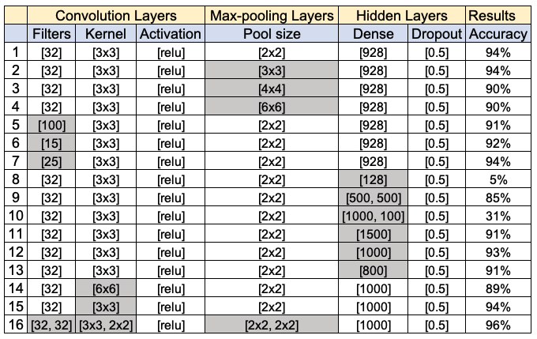

# Traffic Sign Detector
Traffic Sign Detector is an AI that uses Neural Network to identify which traffic sign appears in a photograph.

Demo: https://www.youtube.com/watch?v=k5TJ6ti0pM4

## How to run

`python3 traffic.py gtsrb`

## Experimentation Process
The experimentation process consists of changing the cofiguration of five layers in the CNN (Convolutional Neural Network).

The initial configuration was the same as the one used to classify handwritten digits. However that resulted in an accuracy of 5.5%.

Here is the initial configuration:
tf.keras.layers.Conv2D(32, (3, 3), activation="relu", input_shape=(IMG_WIDTH, IMG_HEIGHT, 3)),
tf.keras.layers.MaxPooling2D(pool_size=(2, 2)),
tf.keras.layers.Flatten(),
tf.keras.layers.Dense(128, activation="relu"),
tf.keras.layers.Dropout(0.5),
tf.keras.layers.Dense(NUM_CATEGORIES, activation="softmax")

To improve the accuracy, the hidden layer density was increased from 128 to 928, which resulted in a huge jump in accuracy from 5.5% to 94%. 

To improve the accuracy further, other layers were changed step-by-step as discussed below:

1. Changing pool size
When the pool size was increased from 2x2 to 3x3, 4x4, and 6x6 the acuracy decreased from 94% to 90%, indicating that the experimentation was failed. 

2. Changing number of filters
When the number of convolution layer filters were increased from 32 to 100, the accuracy drropped to 91%. And when the filters were decreased to 15, the accuracy was again dropped to 92%. Finally, the optimal number of filters were found to be 32

3. Changing hidden layer density
Increasing the hidden layer density from 1000 to 1500 and decreasing the density to 800 resulted in decrease in accuracy to 91%. Adding multiple hidden layers also didn't increase the density. Hence the optimal value of the density was found to be 1000.

4. Changing convolution layers kernel size
Increasing consolution kernal size from 3x3 to 6x6 resulted in decrease in accuracy to 89%.

5. Adding multiple convolution layers and max-pooling layers
Adding another convolution layer along with a max-pooling layer increased the accuracy from 94% to 96%.


Check out the details of these changes in the observation table in the next section.

## Observations table

|    | Filters    | Kernel       | Activation | Pool size    | Dense         | Dropout | Accuracy |
| -- | ---------- | ------------ | ---------- | ------------ | ------------- | ------- | -------- |
| 1  | \[32\]     | \[3x3\]      | \[relu\]   | \[2x2\]      | \[928\]       | \[0.5\] | 94%      |
| 2  | \[32\]     | \[3x3\]      | \[relu\]   | \[3x3\]      | \[928\]       | \[0.5\] | 94%      |
| 3  | \[32\]     | \[3x3\]      | \[relu\]   | \[4x4\]      | \[928\]       | \[0.5\] | 90%      |
| 4  | \[32\]     | \[3x3\]      | \[relu\]   | \[6x6\]      | \[928\]       | \[0.5\] | 90%      |
| 5  | \[100\]    | \[3x3\]      | \[relu\]   | \[2x2\]      | \[928\]       | \[0.5\] | 91%      |
| 6  | \[15\]     | \[3x3\]      | \[relu\]   | \[2x2\]      | \[928\]       | \[0.5\] | 92%      |
| 7  | \[25\]     | \[3x3\]      | \[relu\]   | \[2x2\]      | \[928\]       | \[0.5\] | 94%      |
| 8  | \[32\]     | \[3x3\]      | \[relu\]   | \[2x2\]      | \[128\]       | \[0.5\] | 5%       |
| 9  | \[32\]     | \[3x3\]      | \[relu\]   | \[2x2\]      | \[500, 500\]  | \[0.5\] | 85%      |
| 10 | \[32\]     | \[3x3\]      | \[relu\]   | \[2x2\]      | \[1000, 100\] | \[0.5\] | 31%      |
| 11 | \[32\]     | \[3x3\]      | \[relu\]   | \[2x2\]      | \[1500\]      | \[0.5\] | 91%      |
| 12 | \[32\]     | \[3x3\]      | \[relu\]   | \[2x2\]      | \[1000\]      | \[0.5\] | 93%      |
| 13 | \[32\]     | \[3x3\]      | \[relu\]   | \[2x2\]      | \[800\]       | \[0.5\] | 91%      |
| 14 | \[32\]     | \[6x6\]      | \[relu\]   | \[2x2\]      | \[1000\]      | \[0.5\] | 89%      |
| 15 | \[32\]     | \[3x3\]      | \[relu\]   | \[2x2\]      | \[1000\]      | \[0.5\] | 94%      |
| 16 | \[32, 32\] | \[3x3, 2x2\] | \[relu\]   | \[2x2, 2x2\] | \[1000\]      | \[0.5\] | 96%      |

Same table in image format:


## Output

```sh
$: python3 traffic.py gtsrb

Epoch 1/10
500/500 [==============================] - 7s 12ms/step - loss: 2.6286 - accuracy: 0.5108  
Epoch 2/10
500/500 [==============================] - 7s 13ms/step - loss: 0.7806 - accuracy: 0.7741
Epoch 3/10
500/500 [==============================] - 6s 12ms/step - loss: 0.4954 - accuracy: 0.8542
Epoch 4/10
500/500 [==============================] - 6s 12ms/step - loss: 0.3748 - accuracy: 0.8895
Epoch 5/10
500/500 [==============================] - 6s 13ms/step - loss: 0.3463 - accuracy: 0.9018
Epoch 6/10
500/500 [==============================] - 6s 12ms/step - loss: 0.2873 - accuracy: 0.9171
Epoch 7/10
500/500 [==============================] - 6s 13ms/step - loss: 0.2452 - accuracy: 0.9306
Epoch 8/10
500/500 [==============================] - 6s 13ms/step - loss: 0.2274 - accuracy: 0.9386
Epoch 9/10
500/500 [==============================] - 6s 12ms/step - loss: 0.2430 - accuracy: 0.9376
Epoch 10/10
500/500 [==============================] - 6s 12ms/step - loss: 0.2155 - accuracy: 0.9441
333/333 - 1s - loss: 0.1835 - accuracy: 0.9564 - 934ms/epoch - 3ms/step

```

## Conclusion
After adding a hidden layer of densiity 1000 and adding two convolution layers of 32 filters and kernals 3x3 & 2x2 along with two max-pooliing layers of 2x2 resulted in an accuracy of ~96%. 
